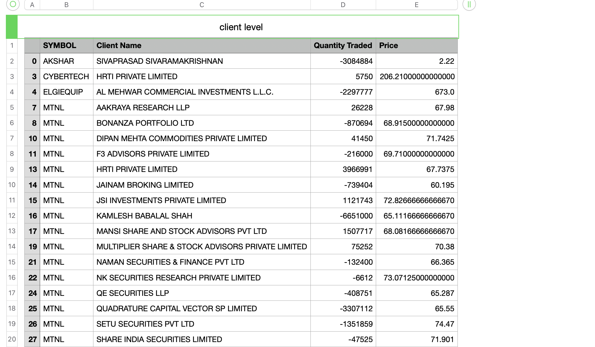
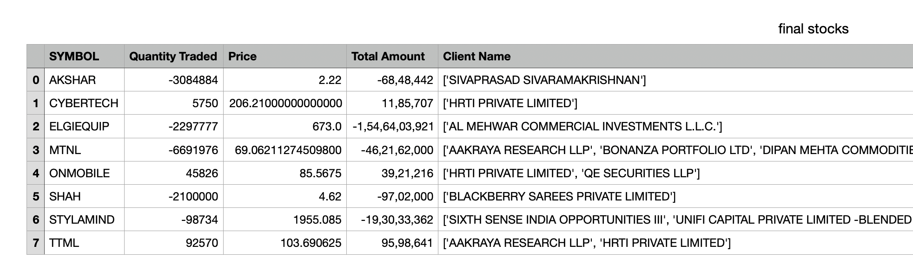
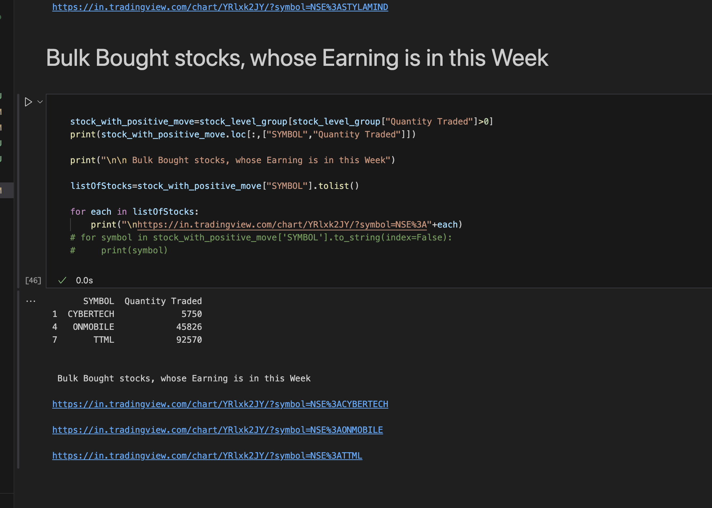

# Stock Algo Trading
- Bulk deals on stocks with earnings due this week

## Prerequisites
- Python and basic pip utilities
- Selenium
- ChromeDriver

## How to Run
- Execute `start.ipynb`

## Sample Results

### Bulk Deal by Client This Week (considering both buy and sell transactions)

### Bulk Deal This Week

### Summary

